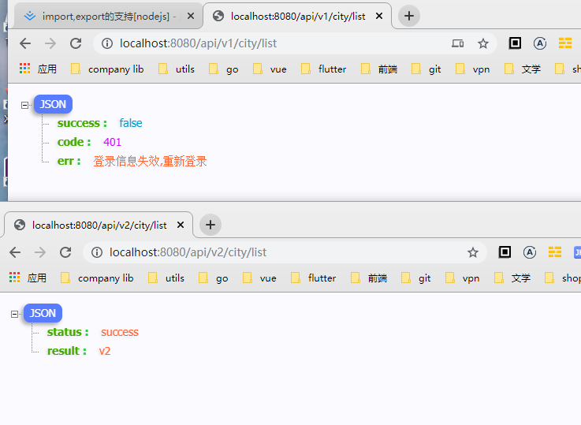
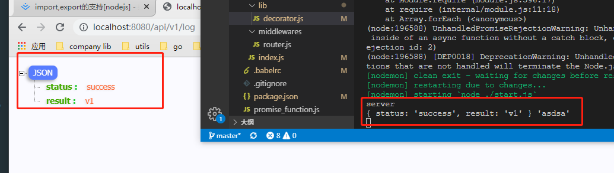

### 相关插件安装

1. babel-plugin-transform-decorators-legacy
2. babel-core 、babel-polyfill
3. koa koa-router glob ramda
4. babel-plugin-transform-object-rest-spread babel-preset-env 

### 问题

1. 解决刀耕火种的router.get 等方法
2. 解决大量的冗余代码
3. 解决中间件难以扩展问题
4. 一个文件生成所有的相关的路由

### 好处

api 升级:
@controller('/api/v1/city')
@controller('/api/v2/city')
<p style="text-align:center">
  
</p>


api登录认证:
@auth
实例: http://localhost:8080/api/v1/city/list
<p style="text-align:center">
  
</p>

api权限认证
@admin

实例: http://localhost:8080/api/v3/city/list

<p style="text-align:center">
  
</p>

api: log添加

实例: http://localhost:8080/api/v1/log
<p style="text-align:center">
  
</p>

api: 验证必填字段
http://localhost:8080/api/v1/log/login

<p style="text-align:center">
  
</p>


```js
const {
  controller,
  get,
  auth,
  admin
} = require('../lib/decorator');

@controller('/api/v1/city')
export class cityController {
  @get('/list') // 控制器
  @auth // 登录认证
  @admin('user') // 权限认证
  @required({ // 必须字段认证
    body: ['email', 'password']
  })
  @log // 操作成功后 发送日志
  async getCityList(ctx, next){
    ctx.body = {
      status: 'success',
      result: 'v1'
    }
  }
}
```

